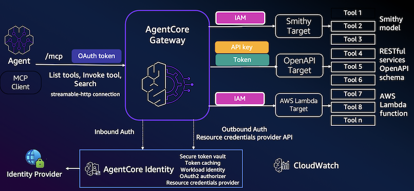
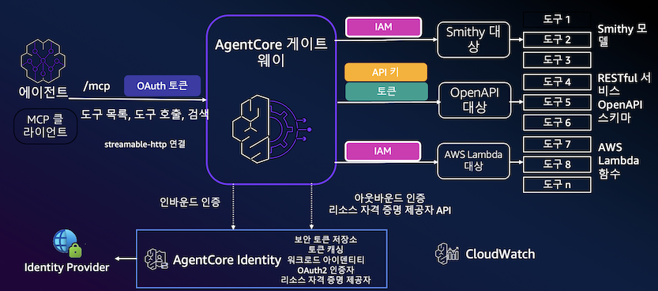
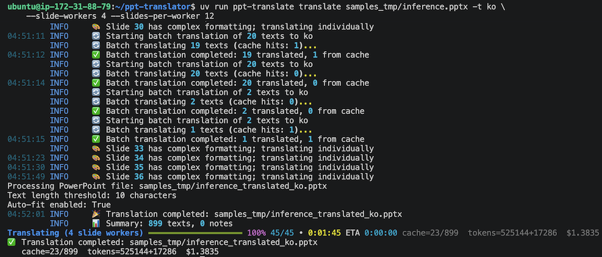
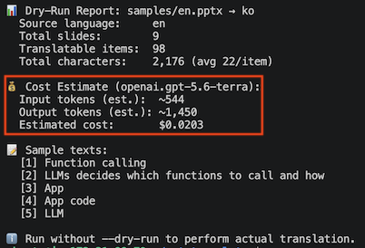
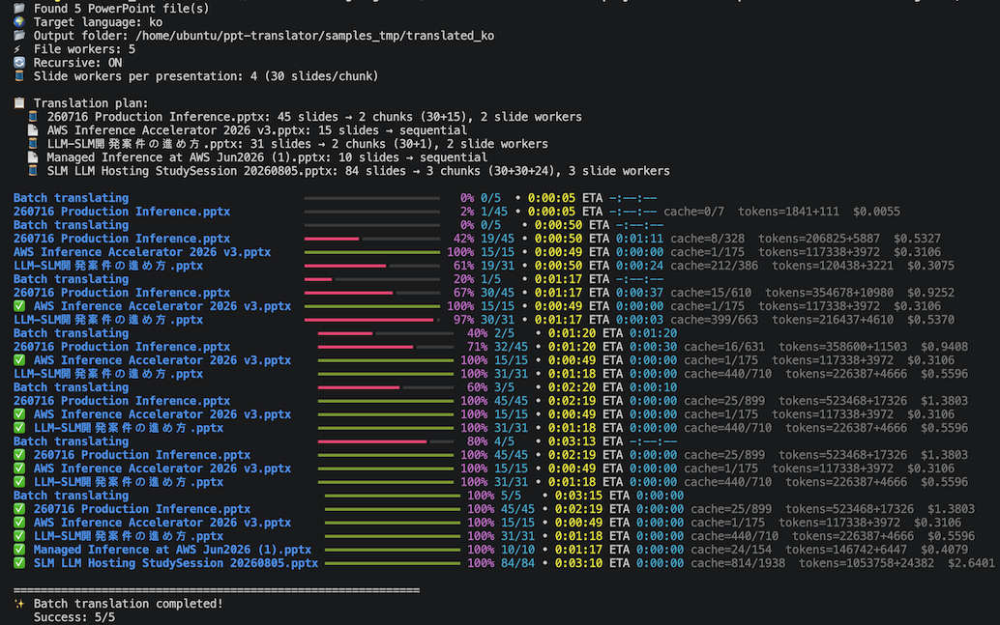

# PowerPoint Translator using Amazon Bedrock

A PowerPoint translation tool that calls OpenAI and Anthropic models through
Amazon Bedrock Mantle while preserving presentation formatting and structure.
Use it as a CLI or a FastMCP server.

**Current release: v1.1.0**

[한국어](README_ko.md) · [Configuration & MCP reference](docs/reference.md) ·
[CLI cheatsheet](docs/cheatsheet.md)

<a href="https://glama.ai/mcp/servers/@daekeun-ml/ppt-translator">
  
</a>

## Features

- GPT-5.6 Sol/Terra/Luna/Cyber and Claude Opus 5/Sonnet 5/Haiku 4.5
- GPT-5.6 Terra as the default model with optional Luna fallback
- AWS default credential chain, short-term Mantle tokens, and SigV4
- Formatting, layout, color, language-specific font, notes, and chart preservation
- Parallel translation for large presentations and multi-file folder batches
- Structured PowerPoint-to-Markdown export with optional web verification
- SQLite or in-memory translation cache
- Source-language detection, custom YAML glossary, and cost dry-run
- Exponential retry for transient errors and model fallback after 429/503 failures
- CLI and FastMCP interfaces

## Examples

The translator preserves complex slide layouts:

<table>
<tr>
<td></td>
<td></td>
</tr>
<tr>
<td align="center"><em>Original English slide</em></td>
<td align="center"><em>Korean translation with preserved layout</em></td>
</tr>
</table>

### Claude Code MCP

<table>
<tr>
<td></td>
<td></td>
</tr>
<tr>
<td align="center"><em>MCP connection check</em></td>
<td align="center"><em>Translation through MCP</em></td>
</tr>
</table>

## Quick Start

### Requirements

- Python 3.11 or later
- AWS account with Amazon Bedrock access
- AWS credentials available through the default credential chain
- Model access in the selected AWS Region

### Install

```bash
git clone https://github.com/daekeun-ml/ppt-translator
cd ppt-translator
uv sync
```

Configure AWS credentials:

```bash
aws configure
export AWS_REGION=us-east-1
# export AWS_PROFILE=default
```

The translator generates short-term tokens for GPT models and uses SigV4 for
Claude models. `AWS_BEARER_TOKEN_BEDROCK` is an optional long-term API key
override.

The built-in defaults are sufficient for normal use. To customize them:

```bash
cp .env.example .env
```

See [Configuration](docs/reference.md#configuration) for all settings. The
README intentionally does not duplicate the complete `.env` file.

## CLI Usage

### Translate an Entire Presentation

```bash
uv run ppt-translate translate samples/en.pptx -t ko
```

Presentations larger than 30 slides are split into parallel chunks:

```bash
# Defaults: up to 4 slide workers, 30 slides per chunk
uv run ppt-translate translate large-deck.pptx -t ko

# 80 slides -> 20+20+20+20
uv run ppt-translate translate large-deck.pptx -t ko \
  --slide-workers 4 --slides-per-worker 20
```



### Batch Translate a Folder

```bash
# Recursive by default
uv run ppt-translate batch-translate samples/ -t ko

# Top-level files only
uv run ppt-translate batch-translate samples/ -t ko --no-recursive

# Output folder and concurrent PowerPoint files
uv run ppt-translate batch-translate samples/ -t ko -o translated_ko/ -w 10
```

`--workers` controls concurrent PowerPoint files. `--slide-workers` controls
parallel slide chunks inside each presentation.


### Translate Specific Slides

```bash
uv run ppt-translate translate-slides samples/en.pptx -s "1,3,5" -t ko
uv run ppt-translate translate-slides samples/en.pptx -s "2-4" -t ko
```

### Export PowerPoint as Markdown

```bash
# AI-structured Korean notes with slide references
uv run ppt-translate export-markdown samples/en.pptx -l ko

# Deterministic extraction without model calls
uv run ppt-translate export-markdown samples/en.pptx \
  --mode extract --language source

# Export every presentation and preserve the folder structure
uv run ppt-translate batch-export-markdown samples/ -l ko

# Verify a bounded set of external claims with client-side web search
uv run ppt-translate export-markdown samples/en.pptx -l ko --web-verify
```

Structured mode summarizes slides in parallel chunks, creates a sourced presentation overview, and preserves tables, chart data, and speaker notes. Each chunk is validated against the requested output language. Invalid or incomplete responses are regenerated and automatically split into smaller chunks when needed; source-language text is never silently substituted into a translated Markdown document. Web verification is opt-in. See the [Markdown export reference](docs/reference.md#markdown-export).

### Dry-Run and Cache

```bash
# Estimate tokens and cost without calling the model
uv run ppt-translate translate samples/en.pptx -t ko --dry-run

# Cache is enabled by default at ~/.ppt-translator/cache.db
uv run ppt-translate translate samples/en.pptx -t ko

# Disable cache
uv run ppt-translate translate samples/en.pptx -t ko --no-cache
```



The following comparison shows a fully cached folder run and a first run that
calls the model:



### Other Common Options

```bash
# Explicit source language skips auto-detection
uv run ppt-translate translate samples/en.pptx --source-language en -t ko

# Use a glossary; ./glossary.yaml is detected automatically
uv run ppt-translate translate samples/en.pptx -t ko -g glossary.yaml

# Leave chart text unchanged
uv run ppt-translate translate samples/en.pptx -t ko --no-charts

# Inspect the first slides
uv run ppt-translate info samples/en.pptx
```

See the [CLI cheatsheet](docs/cheatsheet.md) for the complete everyday command
reference.

## MCP Server

Start the FastMCP server:

```bash
uv run mcp_server.py
```

Then ask the connected assistant naturally:

```text
Translate samples/en.pptx to Korean
Batch-translate samples/ into Japanese, dry-run first
Show me what is in slide 3
Export samples/en.pptx as structured Korean Markdown
```

Host configuration for Claude Code and Kiro, plus the complete MCP tool list,
is in the [Configuration & MCP reference](docs/reference.md#mcp-server).

## Documentation

- [Configuration & MCP reference](docs/reference.md)
- [CLI cheatsheet](docs/cheatsheet.md)
- [Post-processing examples](docs/post_processing_examples.md)
- [PowerPoint handler structure](docs/ppt_handler_structure.md)

## License

This project is licensed under the MIT License. See [LICENSE](LICENSE).
