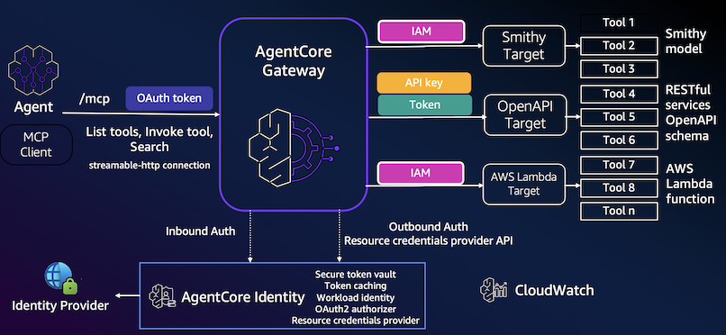
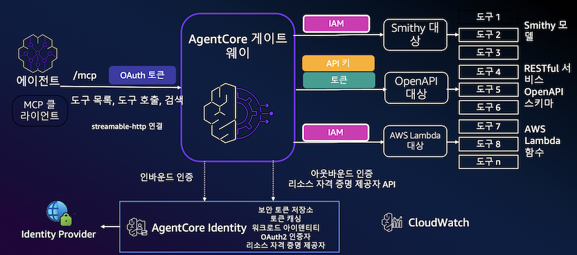
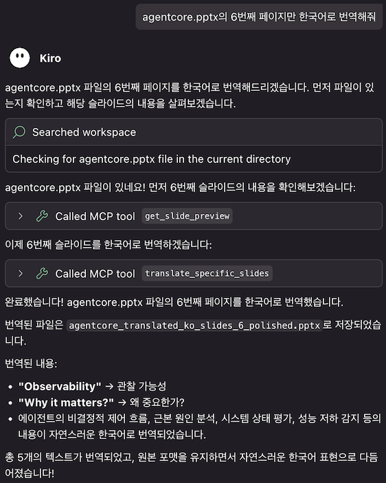
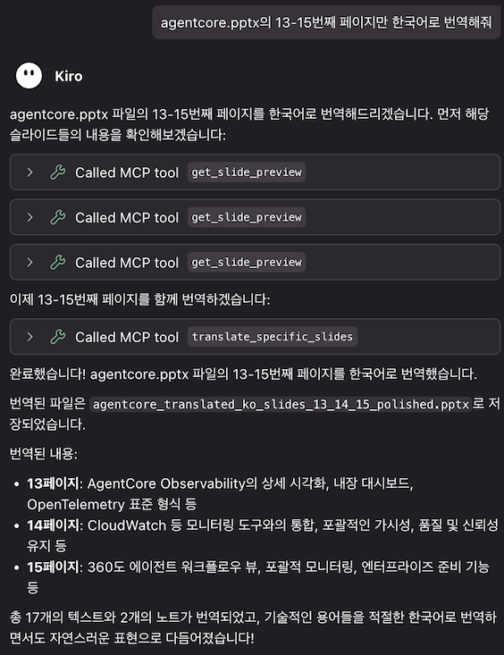
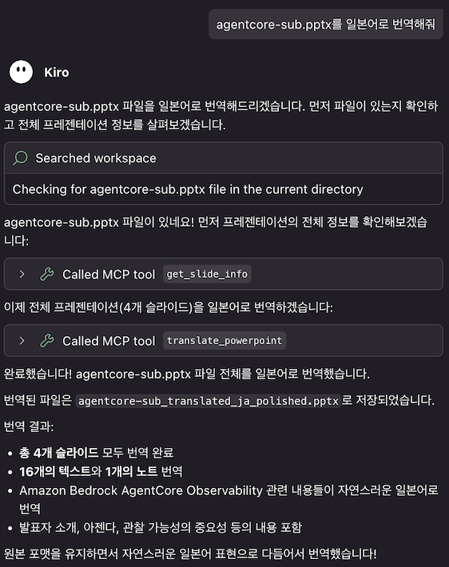
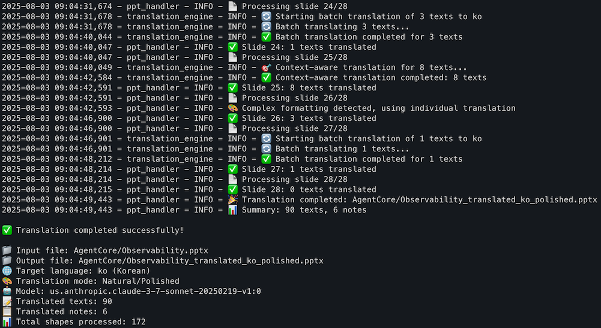

# Amazon Bedrock을 사용한 PowerPoint 번역기

Amazon Bedrock 모델을 활용하여 고품질 번역을 제공하는 강력한 PowerPoint 번역 도구입니다. 이 서비스는 독립 실행형 명령줄 도구로 사용하거나 Amazon Q Developer와 같은 AI 어시스턴트와 통합하기 위한 FastMCP(Fast Model Context Protocol) 서비스로 사용할 수 있습니다. 서식과 구조를 유지하면서 PowerPoint 프레젠테이션을 번역합니다.

## 기능

- **PowerPoint 번역**: PowerPoint 프레젠테이션의 텍스트 내용 번역
- **Amazon Bedrock 통합**: 고품질 번역을 위한 Amazon Bedrock 모델 사용
- **서식 보존**: 원본 서식, 레이아웃 및 스타일 유지
- **언어별 폰트**: 대상 언어에 적합한 폰트 자동 적용
- **색상 및 스타일 보존**: 번역되지 않은 내용도 원본 텍스트 색상과 서식 유지
- **독립 실행형 및 MCP 지원**: 명령줄 도구로 사용하거나 FastMCP를 통해 AI 어시스턴트와 통합
- **다국어 지원**: 다양한 언어 간 번역 지원
- **배치 처리**: 여러 슬라이드와 텍스트 요소를 효율적으로 처리
- **선택적 번역**: 전체 프레젠테이션 또는 특정 슬라이드 번역

## 예제

### 번역

PowerPoint 번역기는 원본 서식을 유지하면서 정확하게 내용을 번역합니다:

<table>
<tr>
<td></td>
<td></td>
</tr>
<tr>
<td align="center"><em>복잡한 레이아웃의 영어 원본 프레젠테이션 슬라이드</em></td>
<td align="center"><em>서식과 레이아웃이 보존된 한국어 번역본</em></td>
</tr>
</table>

### Kiro MCP 예제







### 사용 예제

**전체 프레젠테이션 번역:**
```bash
uv run ppt-translate translate presentation.pptx --target-language ko
```



**특정 슬라이드 번역:**
```bash
uv run ppt-translate translate-slides presentation.pptx --slides "1,3,5" --target-language ja
```

**슬라이드 정보 확인:**
```bash
uv run ppt-translate info presentation.pptx
```


## 사전 요구사항

- Python 3.11 이상
- Bedrock 액세스 권한이 있는 AWS 계정
- 적절한 자격 증명으로 구성된 AWS CLI
- Amazon Bedrock 모델 액세스 권한 (예: Claude, Nova 등)

### AWS 자격 증명 설정

이 서비스를 사용하기 전에 AWS 자격 증명이 올바르게 구성되어 있는지 확인하세요. 여러 옵션이 있습니다:

1. **AWS CLI 구성 (권장)**:
   ```bash
   aws configure
   ```
   다음 정보를 입력하라는 메시지가 표시됩니다:
   - AWS Access Key ID
   - AWS Secret Access Key
   - Default region name
   - Default output format

2. **AWS 프로필 구성**:
   ```bash
   aws configure --profile your-profile-name
   ```

3. **환경 변수** (필요한 경우):
   ```bash
   export AWS_ACCESS_KEY_ID=your_access_key
   export AWS_SECRET_ACCESS_KEY=your_secret_key
   export AWS_DEFAULT_REGION=us-east-1
   ```

4. **IAM 역할** (EC2 인스턴스에서 실행할 때)

서비스는 구성된 AWS 자격 증명을 자동으로 사용합니다. `.env` 파일에서 사용할 프로필을 지정할 수 있습니다.

## 설치

1. **저장소 복제**:
   ```bash
   git clone https://github.com/daekeun-ml/ppt-translator
   cd ppt-translator
   ```

2. **uv를 사용한 의존성 설치 (권장)**:
   ```bash
   uv sync
   ```
   
   또는 pip 사용:
   ```bash
   pip install -r requirements.txt
   ```

3. **환경 변수 설정**:
   ```bash
   cp .env.example .env
   ```
   
   구성에 맞게 `.env` 파일 편집:
   ```bash
   # AWS 구성
   AWS_REGION=us-east-1
   AWS_PROFILE=default
   
   # 번역 구성
   DEFAULT_TARGET_LANGUAGE=ko
   BEDROCK_MODEL_ID=us.anthropic.claude-3-7-sonnet-20250219-v1:0
   
   # 번역 설정
   MAX_TOKENS=4000
   TEMPERATURE=0.1
   ENABLE_POLISHING=true
   BATCH_SIZE=20
   CONTEXT_THRESHOLD=5
   
   # 언어별 폰트 설정
   FONT_KOREAN=맑은 고딕
   FONT_JAPANESE=Yu Gothic UI
   FONT_ENGLISH=Amazon Ember
   FONT_CHINESE=Microsoft YaHei
   FONT_DEFAULT=Arial
   
   # 디버그 설정
   DEBUG=false

   # 후처리 설정
   ENABLE_TEXT_AUTOFIT=true
   TEXT_LENGTH_THRESHOLD=10
   ```

   **참고**: `aws configure`를 사용하여 이미 구성한 경우 `.env` 파일에 AWS 자격 증명(Access Key ID 및 Secret Access Key)이 필요하지 않습니다. 서비스는 AWS CLI 자격 증명을 자동으로 사용합니다.

## 사용법

### 독립 실행형 명령줄 사용

PowerPoint 번역기는 `ppt-translate` 명령을 사용하여 명령줄에서 직접 사용할 수 있습니다:

```bash
# 전체 프레젠테이션을 한국어로 번역
uv run ppt-translate translate samples/en.pptx --target-language ko

# 특정 슬라이드 번역 (개별 슬라이드)
uv run ppt-translate translate-slides samples/en.pptx --slides "1,3" --target-language ko

# 슬라이드 범위 번역
uv run ppt-translate translate-slides samples/en.pptx --slides "2-4" --target-language ko

# 혼합 번역 (개별 + 범위)
uv run ppt-translate translate-slides samples/en.pptx --slides "1,2-4" --target-language ko

# 슬라이드 정보 및 미리보기 확인
uv run ppt-translate info samples/en.pptx

# 도움말 표시
uv run ppt-translate --help
uv run ppt-translate translate --help
uv run ppt-translate translate-slides --help
```

### FastMCP 서버 모드 (AI 어시스턴트 통합용)

Amazon Q Developer와 같은 AI 어시스턴트와 통합하기 위한 FastMCP 서버 시작:

```bash
# uv 사용 (권장)
uv run mcp_server.py

# python 직접 사용
python mcp_server.py
```

## FastMCP 설정 (Amazon Q Developer 및 Kiro)

Amazon Q Developer 또는 Kiro를 아직 설치하지 않았다면 다음을 참조하세요:

- Amazon Q Developer CLI: https://docs.aws.amazon.com/amazonq/latest/qdeveloper-ug/command-line-installing.html
- Kiro: https://kiro.dev

### 2. FastMCP 서버 구성

Q Developer FastMCP 구성 파일을 생성하거나 업데이트하세요:

#### Kiro
**사용자 레벨** `~/.kiro/settings/mcp.json`

#### Amazon Q Developer
**macOS/Linux**: `~/.aws/amazonq/mcp.json`
**Windows**: `%APPDATA%\amazonq\mcp.json`

PowerPoint 번역기 FastMCP 서버 구성 추가:

**uv 사용**:
```json
{
  "mcpServers": {
    "ppt-translator": {
      "command": "uv",
      "args": ["run", "/path/to/ppt-translator/mcp_server.py"],
      "env": {
        "AWS_REGION": "us-east-1",
        "AWS_PROFILE": "default",
        "BEDROCK_MODEL_ID": "us.anthropic.claude-3-7-sonnet-20250219-v1:0"
      },
      "disabled": false,
      "autoApprove": [
        "translate_powerpoint",
        "get_slide_info",
        "get_slide_preview",
        "translate_specific_slides"
      ]
    }
  }
}
```

**python 직접 사용하는 대안 구성**:
```json
{
  "mcpServers": {
    "ppt-translator": {
      "command": "python",
      "args": ["/path/to/ppt-translator/mcp_server.py"],
      "env": {
        "AWS_REGION": "us-east-1",
        "AWS_PROFILE": "default",
        "BEDROCK_MODEL_ID": "us.anthropic.claude-3-7-sonnet-20250219-v1:0"
      },
      "disabled": false,
      "autoApprove": [
        "translate_powerpoint",
        "get_slide_info",
        "get_slide_preview",
        "translate_specific_slides"
      ]    
    }
  }
}
```

**중요**: `/path/to/ppt-translator/`를 복제한 저장소의 실제 경로로 바꾸세요.

### 3. PowerPoint 번역 사용

연결되면 다음과 같은 명령을 사용할 수 있습니다 (사용자 입력은 영어일 필요가 없습니다):

```
original.pptx의 10번부터 13번 슬라이드를 한국어로 번역해주세요.
```

## 사용 가능한 MCP 도구

MCP 서버는 다음 도구를 제공합니다:

- **`translate_powerpoint`**: 전체 PowerPoint 프레젠테이션 번역
  - 매개변수:
    - `input_file`: 입력 PowerPoint 파일 경로 (.pptx)
    - `target_language`: 대상 언어 코드 (기본값: 'ko')
    - `output_file`: 번역된 출력 파일 경로 (선택사항, 자동 생성)
    - `model_id`: Amazon Bedrock 모델 ID (기본값: Claude 3.7 Sonnet)
    - `enable_polishing`: 자연어 다듬기 활성화 (기본값: true)

- **`translate_specific_slides`**: PowerPoint 프레젠테이션의 특정 슬라이드만 번역
  - 매개변수:
    - `input_file`: 입력 PowerPoint 파일 경로 (.pptx)
    - `slide_numbers`: 번역할 슬라이드 번호 (쉼표로 구분, 예: "1,3,5" 또는 "2-4,7")
    - `target_language`: 대상 언어 코드 (기본값: 'ko')
    - `output_file`: 번역된 출력 파일 경로 (선택사항, 자동 생성)
    - `model_id`: Amazon Bedrock 모델 ID (기본값: Claude 3.7 Sonnet)
    - `enable_polishing`: 자연어 다듬기 활성화 (기본값: true)

- **`get_slide_info`**: PowerPoint 프레젠테이션의 슬라이드 정보 확인
  - 매개변수:
    - `input_file`: PowerPoint 파일 경로 (.pptx)
  - 반환값: 슬라이드 수와 각 슬라이드 내용 미리보기가 포함된 개요

- **`get_slide_preview`**: 특정 슬라이드 내용의 상세 미리보기
  - 매개변수:
    - `input_file`: PowerPoint 파일 경로 (.pptx)
    - `slide_number`: 미리보기할 슬라이드 번호 (1부터 시작)

- **`list_supported_languages`**: 번역 지원 대상 언어 목록

- **`list_supported_models`**: 지원되는 모든 Amazon Bedrock 모델 목록

- **`get_translation_help`**: 번역기 사용에 대한 도움말 정보

## 구성

### 환경 변수

- `AWS_REGION`: Bedrock 서비스용 AWS 리전 (기본값: us-east-1)
- `AWS_PROFILE`: 사용할 AWS 프로필 (기본값: default)
- `DEFAULT_TARGET_LANGUAGE`: 번역 기본 대상 언어 (기본값: ko)
- `BEDROCK_MODEL_ID`: 번역용 Bedrock 모델 ID (기본값: us.anthropic.claude-3-7-sonnet-20250219-v1:0)
- `MAX_TOKENS`: 번역 요청 최대 토큰 수 (기본값: 4000)
- `TEMPERATURE`: AI 모델 온도 설정 (기본값: 0.1)
- `ENABLE_POLISHING`: 번역 다듬기 활성화 (기본값: true)
- `BATCH_SIZE`: 배치로 처리할 텍스트 수 (기본값: 20)
- `CONTEXT_THRESHOLD`: 컨텍스트 인식 번역을 트리거할 텍스트 수 (기본값: 5)
- `DEBUG`: 디버그 로깅 활성화 (기본값: false)

### 지원 언어

이 서비스는 다음을 포함한 주요 언어 간 번역을 지원합니다:
- 영어 (en)
- 한국어 (ko)
- 일본어 (ja)
- 중국어 간체 (zh)
- 중국어 번체 (zh-tw)
- 스페인어 (es)
- 프랑스어 (fr)
- 독일어 (de)
- 이탈리아어 (it)
- 포르투갈어 (pt)
- 러시아어 (ru)
- 아랍어 (ar)
- 힌디어 (hi)
- 그 외 다수...

## 문제 해결

### 일반적인 문제

1. **AWS 자격 증명을 찾을 수 없음**:
   - AWS 자격 증명이 올바르게 구성되어 있는지 확인
   - AWS CLI 구성 확인: `aws configure list`

2. **Bedrock 액세스 거부**:
   - AWS 계정에 Bedrock 액세스 권한이 있는지 확인
   - 지정된 모델이 해당 리전에서 사용 가능한지 확인

3. **FastMCP 연결 문제**:
   - mcp.json의 경로가 올바른지 확인
   - Python과 의존성이 올바르게 설치되어 있는지 확인
   - Q Developer의 로그에서 오류 메시지 확인
   - 서버 테스트: `uv run python mcp_server.py`

4. **PowerPoint 파일 문제**:
   - 입력 파일이 유효한 PowerPoint (.pptx) 파일인지 확인
   - 입력 및 출력 경로의 파일 권한 확인

5. **모듈 가져오기 오류**:
   - 적절한 가상 환경 활성화를 위해 `uv run` 사용
   - 의존성 설치: `uv sync`

## 개발

### 프로젝트 구조

```
ppt-translator/
├── mcp_server.py                    # FastMCP 서버 구현
├── main.py                          # 메인 진입점
├── ppt_translator/                  # 핵심 패키지
│   ├── __init__.py                  # 패키지 초기화
│   ├── cli.py                       # 명령줄 인터페이스
│   ├── ppt_handler.py               # PowerPoint 처리 로직
│   ├── translation_engine.py        # 번역 서비스
│   ├── bedrock_client.py            # Amazon Bedrock 클라이언트
│   ├── post_processing.py           # 후처리 유틸리티
│   ├── config.py                    # 설정 관리
│   ├── dependencies.py              # 의존성 관리
│   ├── text_utils.py                # 텍스트 처리 유틸리티
│   └── prompts.py                   # 번역 프롬프트
├── requirements.txt                 # Python 의존성
├── pyproject.toml                   # 프로젝트 설정 (uv)
├── uv.lock                          # 의존성 잠금 파일
├── .env.example                     # 환경 변수 템플릿
├── Dockerfile                       # Docker 설정
├── docs/                            # 문서
├── imgs/                            # 예제 이미지 및 스크린샷
└── samples/                         # 샘플 파일
```

## 라이선스

이 프로젝트는 MIT 라이선스에 따라 라이선스가 부여됩니다. 자세한 내용은 LICENSE 파일을 참조하세요.
